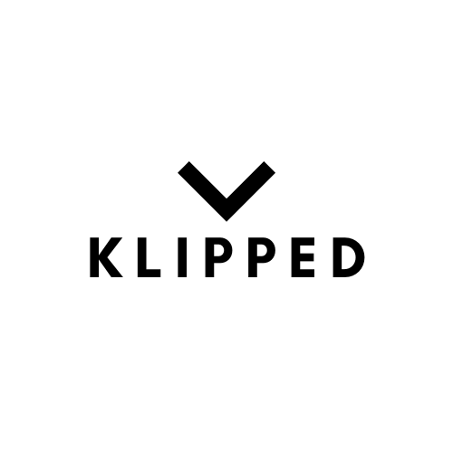

# Klipped



## Overview

**Klipped** is a powerful web application designed to simplify your video downloading experience. With just one click, you can download YouTube videos, Instagram reels, entire YouTube playlists, and even extract audio separately. Plus, Klipped features cutting-edge video summary generation using the LLM Gemini Pro.

## Features

- **Download Any YouTube Video:** Effortlessly download videos from YouTube with a single click.
- **Instagram Reels Downloader:** Save your favorite Instagram reels directly to your device.
- **YouTube Playlist Downloader:** Download entire playlists from YouTube in one go.
- **Audio Extraction:** Extract audio files separately from videos.
- **Video Summary Generation:** Generate concise summaries of videos using LLM Gemini Pro.

## Technologies Used

### Backend
- **Flask:** A lightweight WSGI web application framework in Python.
- **Python:** The backbone of our backend logic.

### Frontend
- **HTML:** The standard markup language for creating web pages.
- **JavaScript:** Enhances user interaction with asynchronous requests.
- **AJAX:** For asynchronous web applications to update parts of a web page without reloading.
- **CSS:** Styles the application for a sleek and modern user interface.

## Installation

1. **Clone the Repository:**
    ```bash
    git clone https://github.com/yourusername/klipped.git
    cd klipped
    ```

2. **Set Up the Virtual Environment:**
    ```bash
    python3 -m venv venv
    source venv/bin/activate  # On Windows use `venv\Scripts\activate`
    ```

3. **Install the Dependencies:**
    ```bash
    pip install -r requirements.txt
    ```

4. **Set Up Environment Variables:**
    Create a `.env` file in the root directory and add your configuration:
    ```env
    FLASK_APP=run.py
    FLASK_ENV=development
    ```

5. **Run the Application:**
    ```bash
    flask run
    ```

## Usage

1. **Navigate to the Application:**
    Open your browser and go to `http://127.0.0.1:5000`.

2. **Download Videos or Extract Audio:**
    - Enter the URL of the video or playlist you want to download.
    - Select the download option (Video/Audio).
    - Click on the download button and let Klipped handle the rest.

3. **Generate Video Summaries:**
    - After downloading, choose the option to generate a summary.
    - Klipped will use LLM Gemini Pro to provide a concise summary of the video content.

## Screenshots


*Screenshot of the home page.*


*Screenshot showing download options.*


*Screenshot showing summary.*

## Contributing

We welcome contributions! Please see our [CONTRIBUTING.md](CONTRIBUTING.md) for guidelines.

## License

This project is licensed under the MIT License. See the [LICENSE](LICENSE) file for details.

## Contact

If you have any questions or suggestions, feel free to contact us at:
- Email: your-email@example.com
- GitHub: [yourusername](https://github.com/yourusername)

---

Enjoy using Klipped and happy downloading!
